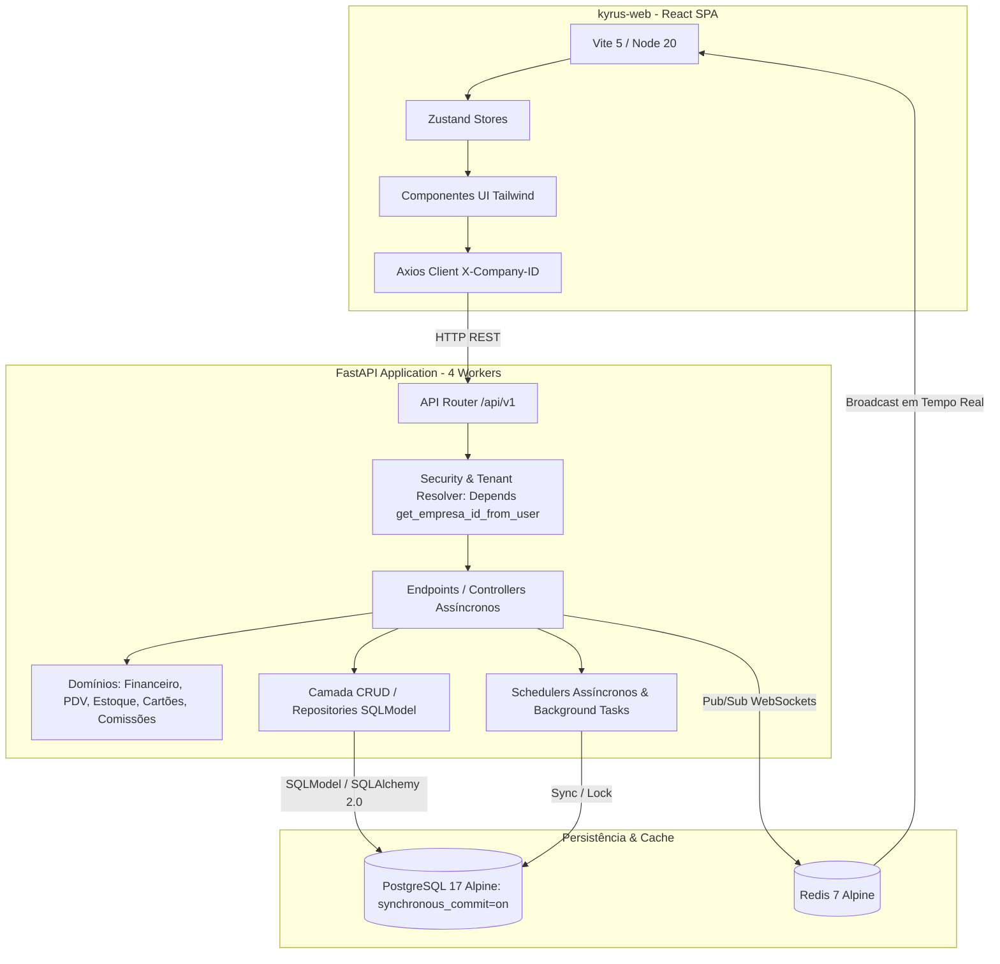

# 🗺️ Mapa de Arquitetura e Funcionalidades - Kyrus ERP

**Padrão Nível Google / Enterprise**  
**Última Atualização**: 26 de Setembro de 2026  

Este documento apresenta uma visão detalhada sobre a arquitetura técnica, as funcionalidades atualmente implementadas e o roadmap de desenvolvimento futuro do **Kyrus ERP**.

---

## 1. Visão Geral do Sistema
O **Kyrus ERP** é um sistema corporativo de gestão empresarial de alta performance focado em controle financeiro avançado, conciliação inteligente, gestão de cartões corporativos, frente de caixa (PDV) com baixa de estoque, comissões de vendas, auditoria de anomalias, integração bancária e consultoria estratégica auxiliada por Inteligência Artificial (IA). O sistema possui suporte nativo a multiempresa e controle de acesso granular baseado em perfis (RBAC).

---

## 2. Arquitetura Técnica

O projeto opera sob uma arquitetura de microsserviços containerizados de alto throughput:

### 💻 Frontend (`kyrus-web/`)
*   **Core**: React 18 (TypeScript estrito) com Vite para compilação rápida e HMR.
*   **Gerenciamento de Estado**: Zustand desacoplado (sem loops de referência de memória ou dependências circulares).
*   **Comunicação em Tempo Real**: WebSocket client integrado para push notifications e sincronização multi-usuário.
*   **Visualização de Dados**: Gráficos analíticos de fluxo de caixa, DRE e orçamentos.
*   **Segurança no Cliente**: Injeção dinâmica do header `X-Company-ID` para consultores multiempresa.

### ⚙️ Backend (`app/`)
*   **Framework**: FastAPI com Uvicorn executando 4 workers concorrentes.
*   **ORM**: SQLModel / SQLAlchemy 2.0 com suporte a queries assíncronas de alto desempenho.
*   **Banco de Dados**: PostgreSQL 17 Alpine com connection pooling pré-aquecido e 48 modelos registrados no Alembic.
*   **Durabilidade ACID**: `synchronous_commit=on` garantindo segurança contra corrupção em falhas elétricas.
*   **Cache & Pub/Sub**: Redis 7 Alpine para distribuição de eventos de sincronização em tempo real.
*   **Schedulers Internos**: Sincronizadores assíncronos (`integracao_scheduler.py`) e limpeza periódica de demos (`demo_cleanup_service.py`).

---

## 3. Funcionalidades Atualmente Implementadas

### 📈 Gestão Financeira e Fluxo de Caixa
*   **Lançamentos Financeiros**: Controle de mais de 399.000 lançamentos com valores previstos e realizados, categorização hierárquica por plano de contas, vinculação a contas, cartões e centros de custo.
*   **Boletim Financeiro Anual**: Painel consolidado com performance sub-segundo e consultas indexadas.
*   **Contas e Disponibilidades**: Gestão de contas correntes, caixas físicos e conciliação de saldos.

### 📑 Demonstrativo do Resultado do Exercício (DRE)
*   **Regimes de Caixa e Competência**: Geração dinâmica por pagamentos efetivos ou competência de parcelas.
*   **Drill-Down por Célula**: Abertura lateral inspecionando todos os lançamentos que compõem cada saldo da DRE.
*   **Indicadores Gerenciais**: Margem de Contribuição, Lucratividade, Ponto de Equilíbrio Operacional e EBITDA.

### 💳 Cartões Corporativos & Conciliação em Lote
*   **Gestão de Cartões**: Faturas de crédito e débito, limites, datas de corte e vencimento.
*   **Upload Otimizado de Planilhas (`upload_xlsx`)**: Processamento de extratos com milhares de linhas sem congelamento do event loop do FastAPI.
*   **Regras Inteligentes (`RegraCartao`)**: Classificação automática de despesas via palavras-chave e regex.

### 📦 Estoque, Compras & Inventário
*   **Catálogo de Produtos (`Produto`)**: Controle de SKU, código de barras, estoque mínimo, preço de venda e custo médio ponderado.
*   **Equivalência de Fornecedores (`FornecedorProdutoEquivalencia`)**: Mapeamento inteligente de códigos de fornecedor para produtos internos a partir de notas fiscais (XML).
*   **Kardex de Movimentações (`MovimentacaoEstoque`)**: Registro auditado de entradas por compra, saídas por venda PDV, quebras e inventário.

### 🏪 Frente de Caixa (PDV) & Delivery
*   **Terminal de Venda Rápida**: Vendas diretas com seleção de cliente, vendedor e meios de pagamento múltiplos.
*   **Baixa Automática de Estoque**: Débito imediato no Kardex a cada venda efetuada.
*   **Metadados em JSON**: Campo `observacao` com persistência estruturada de dados de delivery, TEF e autorizações.
*   **Controle Rigoroso de Caixa**: Abertura, fechamento cego/conferido, suprimentos e sangrias protegidas por permissões gerenciais (`PDV_CANCELAR_VENDA`, `PDV_REALIZAR_SANGRIA`, `PDV_VER_TODAS_VENDAS`).

### 🎯 Comissões & Metas Comerciais
*   **Regras Flexíveis (`RegraComissao`)**: Comissionamento dinâmico percentual ou fixo por produto, categoria ou vendedor.
*   **Metas Periódicas (`MetaVendedor`)**: Acompanhamento de produtividade comercial e cálculo automatizado de fechamentos.
*   **Blindagem Multiempresa**: Endpoints protegidos contra IDOR e comissões isoladas por tenant (`Depends(get_empresa_id_from_user)`).

### 🚨 Auditoria, Detecção de Anomalias & RBAC
*   **Trilha Imutável (`audit_logs`)**: Registro de snapshots antes e depois de cada operação, IP e identificação do operador.
*   **Motor de Detecção de Anomalias (`AlertaAnomalia`)**: Alertas automáticos para desvios estatísticos de despesas, sangrias anormais e pagamentos em duplicidade.
*   **Silenciamento de Falsos Positivos (`RegraSilenciamentoAuditor`)**: Configuração de exceções permitidas pela diretoria.
*   **RBAC Granular**: Controle de acesso por escopo (`Security(get_current_user_with_permission)`).

### 🤖 Inteligência Artificial (AI)
*   **Assistente Financeiro Integrado**: Chatbot analítico (`ai_assistente`) treinado no contexto financeiro da empresa.
*   **Diagnóstico de Consultoria**: Geração automatizada de laudos de saúde contábil para conselheiros e diretores.

---

## 4. O que Falta Desenvolver (Roadmap Futuro)

1. **🔗 Conciliação Bancária via Open Finance Nativa**: Integração direta com Pluggy / Celcoin para sincronização bancária contínua de extratos sem upload de OFX.
2. **🧾 Emissão Direta de Notas Fiscais Eletrônicas (NFS-e / NFC-e / NF-e)**: Integração com APIs emissoras (ex: Focus NFe) direto no checkout do PDV e no financeiro.
3. **🖨️ Motor de Exportação Nativa de Relatórios Executivos (PDF / Excel)**: Geração de cadernos executivos formatados da DRE e Boletim Financeiro direto do servidor.
4. **🔔 Régua de Cobrança e Alertas Automatizados**: Envio de lembretes e links de PIX via WhatsApp e e-mail integrados com o gateway de cobrança.
5. **🔮 Projeções de Fluxo de Caixa Preditivas**: Modelos estatísticos e de IA para antecipação de liquidez e cenários de sazonalidade futura.

