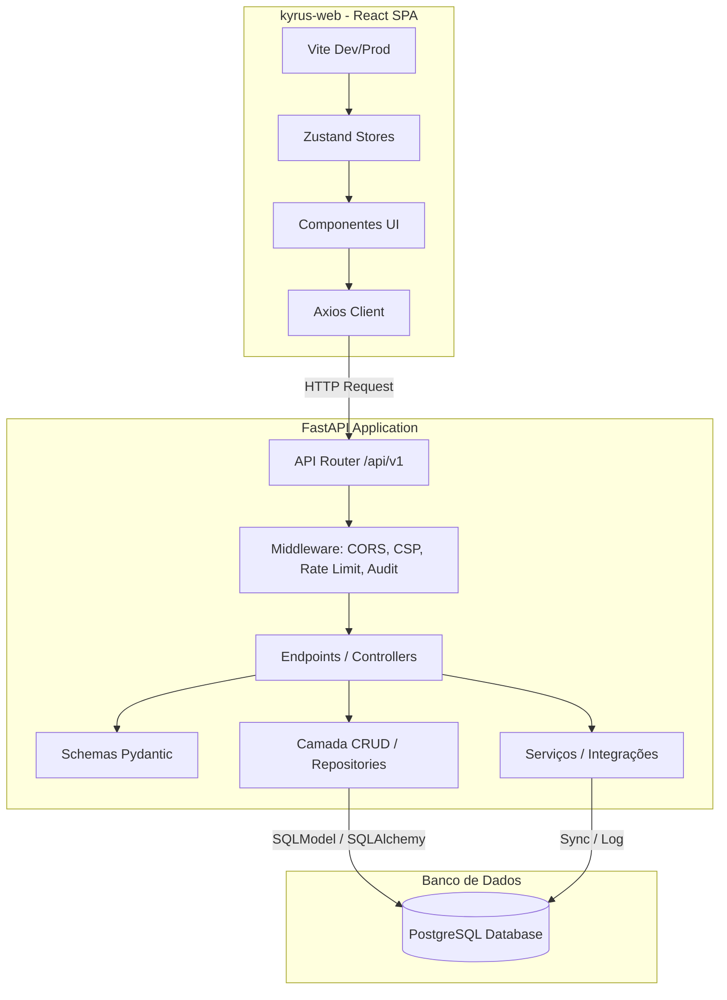

# 🗺️ Mapa de Arquitetura e Funcionalidades - Kyrus ERP

Este documento apresenta uma visão detalhada sobre a arquitetura técnica, as funcionalidades atualmente implementadas e o roadmap de desenvolvimento futuro do **Kyrus ERP**.

---

## 1. Visão Geral do Sistema
O **Kyrus ERP** é um sistema de gestão empresarial focado em controle financeiro avançado, conciliação inteligente, integração com gateways de pagamento (Asaas), frente de caixa (PDV) e consultoria estratégica auxiliada por Inteligência Artificial (IA). O sistema possui suporte nativo a multiempresa e controle de acesso granular baseado em perfis (RBAC).

---

## 2. Arquitetura Técnica

O projeto é construído em cima de uma arquitetura modular moderna e conteinerizada:

### 💻 Frontend (`kyrus-web/`)
*   **Core**: React (TypeScript) com Vite para bundling rápido.
*   **Gerenciamento de Estado**: Zustand (leve, modular e baseado em hooks, ex: `authStore.ts`, `lookupStore.ts`).
*   **Estilização**: CSS Vanilla combinado com classes utilitárias para layouts responsivos.
*   **Visualização de Dados**: ApexCharts para geração de gráficos de fluxo de caixa e orçamentos.
*   **Ícones**: Lucide React.

### ⚙️ Backend (`app/`)
*   **Framework**: FastAPI (rotas assíncronas, documentação automática OpenAPI, injeção de dependências).
*   **ORM**: SQLModel (une a validação do Pydantic com a flexibilidade do SQLAlchemy).
*   **Banco de Dados**: PostgreSQL com migrações gerenciadas pelo Alembic.
*   **Logs**: Loguru para logging estruturado e rotativo.
*   **Scheduler Interno**: Planejador assíncrono rodando em background para sincronizações bancárias periódicas.

---

## 3. Funcionalidades Atualmente Implementadas (O que ele tem)

### 📈 Gestão Financeira e Fluxo de Caixa
*   **Lançamentos Financeiros**: Cadastro completo de receitas e despesas com diferenciação entre valores previstos e pagos, categorização por plano de contas e vinculação a contas bancárias/caixas e centros de custo.
*   **Boletim Financeiro**: Painel anual consolidado que agrupa mensalmente todas as transações, otimizado com requisição paralela única e payload minimizado (bypass de validação Pydantic no backend para rapidez máxima).
*   **Contas e Disponibilidades**: Gestão de contas correntes, contas de caixa físico e cartões de crédito.

### 📑 Demonstrativo do Resultado do Exercício (DRE)
*   **Regimes de Caixa e Competência**: Geração da DRE selecionando lançamentos pagos (regime de caixa) ou pela data de competência das parcelas.
*   **Auditoria por Célula (Drill-Down)**: Possibilidade de clicar em qualquer célula de valor da DRE para abrir uma gaveta lateral mostrando todos os lançamentos que compõem aquele saldo.
*   **Cálculo de Indicadores**: Margem de contribuição (MC), Resultado Operacional, Lucratividade, Ponto de Equilíbrio e Margem MC.

### 🤖 Inteligência Artificial (AI)
*   **Assistente Financeiro Integrado**: Chatbot inteligente (`ai_assistente`) capaz de ler o contexto financeiro da empresa, orçamentos e lançamentos para responder perguntas estratégicas e sugerir planos de ação.
*   **Diagnóstico de Consultoria**: Geração automatizada de diagnósticos de saúde financeira baseados em balanços reais para apoiar o consultor.

### 📥 Importação e Conciliação Avançada
*   **Importação de OFX**: Upload de arquivos de extrato bancário com algoritmos de sugestão automática de plano de contas e centro de custo baseados em regras históricas de mapeamento.
*   **Importação de NF-e (XML)**: Importação de notas fiscais de mercadorias com leitura do XML, criação/atualização de clientes/fornecedores, cálculo automático de competência com base na emissão e divisão de parcelas.
*   **Reconciliação de Cartões**: Mapeamento de lotes e parcelas de cartões com aplicação de regras de taxas administrativas e prazos de antecipação.

### 🏪 Frente de Caixa (PDV)
*   **Módulo de Venda Rápida**: Terminal de ponto de venda para registro ágil de vendas de produtos/serviços.
*   **Fechamento de Caixa**: Fluxo guiado para conferência de saldos em dinheiro, cartão e PIX no fim do expediente.

### 🛡️ Auditoria, Segurança e RBAC
*   **Trilha de Auditoria (Audit Logs)**: Histórico completo que registra o usuário, IP, dispositivo e as modificações detalhadas (JSON de antes e depois) de cada alteração no sistema.
*   **Sistema de Desfazer (Undo)**: Capacidade de reverter exclusões ou edições de lançamentos financeiros diretamente da tela de auditoria.
*   **RBAC (Role-Based Access Control)**: Controle de acesso granular onde permissões são vinculadas a perfis e perfis são atribuídos a usuários dentro de empresas.

---

## 4. O que Falta Desenvolver (Roadmap de Melhorias)

Para elevar o Kyrus ERP ao nível das principais soluções SaaS do mercado, as seguintes frentes de desenvolvimento estão planejadas ou pendentes:

### 1. 🔗 Conciliação Bancária via Open Finance (API Direta)
*   **Objetivo**: Eliminar a necessidade de baixar e subir arquivos `.ofx` manualmente.
*   **Como fazer**: Integrar com APIs de provedores de Open Finance (ex: Pluggy, Celcoin) para capturar o extrato bancário das contas conectadas em tempo real.

### 2. 📦 Módulo de Compras e Gestão de Estoque (Inventário)
*   **Objetivo**: Integrar as compras à contabilidade física dos produtos.
*   **Como fazer**: Aproveitar o XML das Notas Fiscais (NF-e) importadas para alimentar automaticamente o estoque físico de mercadorias, calculando a média ponderada de custo e gerando o CMV (Custo das Mercadorias Vendidas) real na DRE de forma automática.

### 3. 🧾 Emissão Direta de Notas Fiscais (NF-e, NFS-e, NFC-e)
*   **Objetivo**: Permitir que o ERP emita notas fiscais de venda ou prestação de serviços.
*   **Como fazer**: Desenvolver integração com APIs emissoras (ex: Focus NFe) ou direto com a SEFAZ/Prefeituras para gerar a nota diretamente após a venda no PDV ou faturamento de um lançamento.

### 4. 🖨️ Exportação Física de Relatórios (PDF e Excel)
*   **Objetivo**: Permitir o download para compartilhamento externo de relatórios estratégicos.
*   **Como fazer**: Adicionar botões de exportação gerando planilhas formatadas (`.xlsx`) no backend e relatórios executivos em formato PDF da DRE e do Boletim Financeiro.

### 5. 🔔 Régua de Cobrança e Alertas Automatizados
*   **Objetivo**: Reduzir a inadimplência notificando clientes automaticamente.
*   **Como fazer**: Criar um serviço de background integrado ao Asaas e aos lançamentos previstos que envie lembretes de vencimento ou links de pagamento por WhatsApp e E-mail de forma automática.

### 6. 🔮 Projeções Financeiras Preditivas
*   **Objetivo**: Usar estatística e IA para antecipar o fluxo de caixa dos próximos meses.
*   **Como fazer**: Alimentar os modelos de IA com os dados históricos de sazonalidade dos lançamentos para traçar cenários otimistas, pessimistas e realistas de fluxo de caixa futuro de forma visual.
