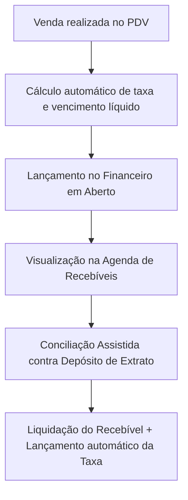

# Manual da Conciliadora de Cartões (Kyrus ERP)

Este documento explica em detalhes o funcionamento da **Conciliadora de Cartões**, módulo responsável por prever vencimentos líquidos, controlar taxas de administração/antecipação e conciliar depósitos bancários de adquirentes contra vendas do PDV.

---

## 1. Visão Geral do Fluxo

A Conciliadora de Cartões funciona de forma integrada entre o **PDV (Frente de Caixa)** e o **Financeiro**. O fluxo é dividido em 4 etapas:

1. **A Venda**: Ao realizar uma venda por cartão (crédito/débito) no PDV, o sistema consulta a regra cadastrada para aquela bandeira e tipo de pagamento.
2. **Cálculo da Provisão**: O sistema calcula a data exata do repasse, desconta a taxa da adquirente (e de antecipação, se houver) e gera os lançamentos financeiros em aberto com o valor líquido previsto.
3. **Agenda de Recebíveis**: As parcelas e previsões de repasse ficam listadas em uma linha do tempo organizada pela data de vencimento líquido.
4. **Conciliação e Baixa**: Quando a adquirente deposita o dinheiro na conta bancária (verificado via extrato de importação OFX), o usuário utiliza o painel de **Conciliação Assistida** para cruzar o depósito com o lote de recebíveis correspondentes. O sistema baixa o recebível como pago e lança o valor das taxas automaticamente como despesa financeira.

---

## 2. Regras de Payout (Prazos de Recebimento)

Cada adquirente possui regras específicas de repasse. O sistema permite configurar três tipos principais de prazos:

### A. Dias Corridos (D+X)
* **Como funciona**: Soma-se o número de dias corridos à data da venda.
* **Exemplo**: Venda em 13/06/2026 com D+30 corridos vencerá em 13/07/2026.

### B. Dias Úteis (D+X úteis)
* **Como funciona**: Soma-se apenas os dias de semana (segunda a sexta), pulando feriados nacionais e finais de semana.
* **Exemplo**: Venda em 13/06/2026 (sábado) com D+1 dia útil vencerá na terça-feira (16/06/2026), pois segunda-feira (15/06) é o primeiro dia útil após o sábado da venda.

### C. Dia Fixo do Mês
* **Como funciona**: O repasse é agendado sempre para um dia específico (ex: todo dia 5). Se a venda ocorrer antes do dia fechamento, ela cai no próximo dia de repasse do mesmo mês; caso contrário, vai para o mês seguinte.
* **Exemplo**: Repasse configurado para todo dia 5 do mês.

### Rollover de Fim de Semana (fds_proximo_dia_util)
Se a data de vencimento calculada (em dias corridos ou fixo) cair em um sábado ou domingo, e esta opção estiver ativa, o sistema **empurra o vencimento automaticamente para a segunda-feira seguinte**.

---

## 3. Modos de Parcelamento e Antecipação

Para vendas parceladas (ex: 3x no cartão de crédito), há duas formas configuráveis de recebimento:

### A. Mês a Mês (Pro-Rata)
As parcelas são pagas individualmente pela adquirente respeitando o prazo D+X de cada uma.
* **Cálculo**:
  * Parcela 1: Data de Venda + 30 dias.
  * Parcela 2: Data de Venda + 60 dias.
  * Parcela 3: Data de Venda + 90 dias.
* **Taxa**: A taxa administrativa da regra é aplicada igualmente a cada parcela.

### B. Antecipação Total
A adquirente desconta uma taxa administrativa de venda e uma **taxa de antecipação extra** para repassar o valor total líquido da venda à vista (normalmente em D+1 ou D+30).
* **Cálculo da Taxa de Antecipação**:
  * É cobrada uma taxa pro-rata baseada no tempo antecipado de cada parcela.
  * O sistema calcula a taxa de antecipação consolidada e gera **uma única parcela a receber em D+X** (com o valor total bruto da venda menos todas as taxas aplicadas).

---

## 4. O Motor de Auto-Match (Conciliação Assistida)

Quando o extrato bancário (OFX) é importado, ele apresenta lançamentos de recebimento de valores consolidados (ex: um depósito da Cielo S.A. no valor de R$ 975,00). Fazer a baixa manual de cada venda individual que compõe esse valor seria exaustivo.

O **Motor de Auto-Match** resolve isso executando o seguinte algoritmo:

1. **Seleção do Alvo**: O usuário clica em um depósito do extrato bancário.
2. **Busca e Filtragem**: O sistema busca todos os recebíveis de cartão da empresa que estão com status `EM ABERTO` e cujo vencimento previsto esteja em uma janela de **até 7 dias** da data do depósito bancário.
3. **Cálculo de Combinações**:
   * **Lote por Dia e Bandeira**: Agrupa todos os recebíveis de mesma data de vencimento e mesma bandeira (ex: todas as vendas Visa que devem cair juntas no dia 13/07/2026). O sistema soma os valores líquidos previstos.
   * **Individual (Avulso)**: Analisa vendas que caíram sozinhas.
   * **Combinações Avançadas**: Executa análise combinatória combinando de 2 a 6 recebíveis de datas próximas para encontrar uma soma perfeita.
4. **Cálculo do Score de Match**:
   * O sistema compara o valor líquido total da combinação com o valor do depósito.
   * Se a diferença de valor for menor que R$ 0,10, o match é elegível.
   * O score inicia em 100% (ou 95%) e vai diminuindo 5% para cada dia de diferença entre a data de previsão e a data real de depósito.
5. **Apresentação**: O usuário visualiza as sugestões com selos coloridos de score (verde para alta confiança, amarelo para média) e clica em **Conciliar** na opção correta.

---

## 5. Como Configurar e Utilizar (Passo a Passo)

### Passo 1: Preparar o Plano de Contas
Para que o sistema consiga contabilizar as taxas retidas pelas adquirentes de cartão, é necessário ter uma categoria de despesa financeira/taxa ativa:
1. Acesse **Configurações** > **Plano de Contas**.
2. Garanta que exista uma conta de despesa do tipo **D** (Despesa) que permita lançamentos com nome de "Taxas e Tarifas de Cartão" ou similar.

### Passo 2: Cadastrar as Regras de Cartão
Defina as condições comerciais negociadas com cada adquirente por bandeira:
1. Acesse **Conciliadora de Cartões** > Aba **Regras das Adquirentes**.
2. Clique em **Nova Regra**.
3. Preencha os campos:
   * **Forma de Pagamento**: Escolha se a regra se aplica a Crédito à Vista, Crédito Parcelado ou Débito.
   * **Bandeira**: Selecione a bandeira (ex: Visa, Mastercard, Elo).
   * **Taxa de Administração (%)**: Insira a taxa base cobrada (ex: `2.50` para 2,5%).
   * **Tipo de Prazo**: Selecione entre Dias Corridos, Dias Úteis ou Dia Fixo.
   * **Dias Payout**: Quantidade de dias para recebimento (ex: `30` para receber em 30 dias).
   * **FDS vai p/ 2ª Útil**: Marque se deseja que repasses em finais de semana caiam na segunda-feira.
   * **Regra de Parcelamento**: Para crédito parcelado, defina se receberá **Mês a Mês** ou **Antecipado** (insira a taxa de antecipação extra se for antecipado).
   * **Conta Bancária Destino**: Selecione em qual conta bancária os depósitos desta bandeira caem por padrão.
   * **Categoria de Despesa de Taxa**: Selecione a conta do plano de contas que receberá o lançamento da despesa da taxa (configurada no Passo 1).
4. Clique em **Salvar Regra**.

### Passo 3: Registrar Vendas
Agora, toda venda efetuada no **PDV** utilizando as formas de pagamento mapeadas calculará automaticamente os recebíveis:
1. No PDV, realize uma venda de R$ 1.000,00 selecionando "Crédito à Vista" (Visa).
2. O sistema gerará um lançamento de receita de R$ 1.000,00 no financeiro, mas com vencimento projetado em D+30 (ajustado para dia útil se necessário) e metadados registrando a taxa de adm de R$ 25,00 e valor líquido previsto de R$ 975,00.

### Passo 4: Acompanhar a Agenda
1. Vá em **Conciliadora de Cartões** > Aba **Agenda de Recebíveis**.
2. Use os cards de resumo no topo para acompanhar o total bruto previsto, as taxas cobradas e o saldo líquido que entrará na conta bancária.
3. A timeline agrupa as previsões dia a dia, detalhando bandeira, parcela e valores.

### Passo 5: Efetuar a Conciliação Assistida
1. Vá em **Conciliadora de Cartões** > Aba **Conciliação Assistida**.
2. O painel esquerdo mostrará os depósitos bancários de extrato OFX que estão pendentes de baixa.
3. Clique em um depósito (ex: Cielo R$ 975,00).
4. O painel direito mostrará as sugestões calculadas pelo motor. Selecione a sugestão de **100% Match** (Lote previsto de R$ 975,00) e clique em **Conciliar**.
5. No modal de confirmação, selecione a conta de destino correta e confirme.
6. **O que o sistema faz por trás**:
   * Altera o status do recebível da venda de `EM ABERTO` para `PAGO`.
   * Cria um lançamento de despesa do tipo **DESPESA** no valor das taxas (ex: R$ 25,00), associado ao plano de contas de taxa e marcado como **PAGO**.
   * Vincula ambos os lançamentos (recebível de venda e taxa de despesa) ao ID do lote e marca o depósito do extrato bancário como **CONCILIADO**.
