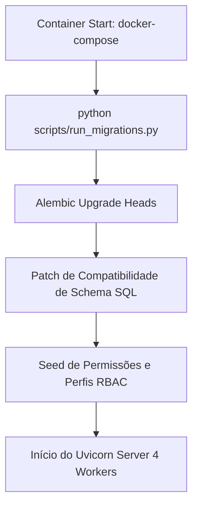

# Arquitetura de Inicialização e Performance (Kyrus ERP)

Este documento descreve as diretrizes de arquitetura para a inicialização do backend no Docker, gestão do banco de dados e otimizações de performance.

---

## 1. Fluxo de Inicialização do Backend (`scripts/run_migrations.py`)

Ao iniciar ou reiniciar os containers Docker do ecossistema Kyrus ERP, o serviço `kyrustech_backend` executa a seguinte sequência:



### Otimização de Boot
- **Remoção de Checagens Legadas**: As checagens automáticas de migração de bancos legados antigos (`CasaOS / PostgreSQL`) foram desativadas na rotina de startup.
- **Resultado**: O backend agora não realiza tentativas de conexão TCP externas para instâncias de bancos legados que não existem mais na infraestrutura atual, reduzindo o tempo de boot para **~1-2 segundos**.

---

## 2. Padrões de Performance e Banco de Dados

### A. Pre-warming de Pool de Conexões
No evento de lifespan da aplicação FastAPI (`app/main.py`), o pool do SQLAlchemy é pré-aquecido (*pre-warmed*) com conexões ativas e o Garbage Collector é ajustado (`gc.set_threshold(7000, 10, 10)`) para lidar com cargas de alta frequência sem latências de alocação.

### B. Trava de Segurança e Integridade Financeira
- Alteraçoes em títulos ou recebíveis vinculados a lançamentos pagos ou extratos bancários conciliados são bloqueadas em nível de API (`400 Bad Request`).
- Lançamentos de despesa de taxas adquirentes são registrados exclusivamente na data real do pagamento (`data_pagamento`).

---

## 3. Deploy Local e Produção

### Comandos de Deploy com Docker Compose
```bash
# Recompilar bundles do frontend
cd kyrus-web
npm run build
cd ..

# Reconstruir e subir containers do ecossistema local
docker compose up -d --build
```
