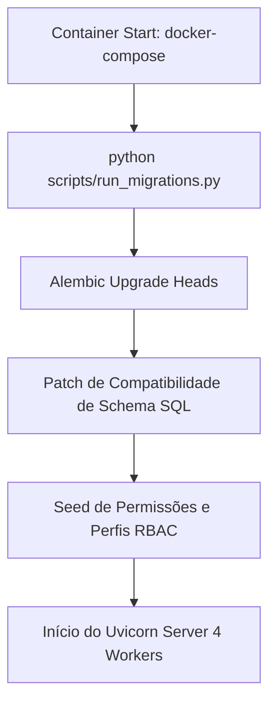

# Arquitetura de Inicialização, Containers e Performance (Kyrus ERP)

Este documento descreve as diretrizes de arquitetura para a inicialização do backend no Docker, gestão do banco de dados, otimização de builds de imagem e segurança de dados.

---

## 1. Fluxo de Inicialização do Backend (`scripts/run_migrations.py`)

Ao iniciar ou reiniciar os containers Docker do ecossistema Kyrus ERP, o serviço `kyrustech_backend` executa a seguinte sequência:



### Otimização de Boot
- **Remoção de Checagens Legadas**: As checagens automáticas de migração de bancos legados antigos (`CasaOS / PostgreSQL`) foram desativadas na rotina de startup.
- **Resultado**: O backend não realiza mais tentativas de conexão TCP externas para instâncias legadas que não existem na infraestrutura atual, reduzindo o tempo de boot para **~1-2 segundos**.

---

## 2. Otimização de Imagens Docker e Build Context

### A. Filtragem Rígida de Contexto (`.dockerignore`)
- **Problema Anterior**: Dumps de banco de dados (`*.dump`, `*.sql`, `backup*`), planilhas locais (`*.xlsx`, `*.tsv`) e a pasta inteira do frontend (`kyrus-web/`) somavam **mais de 1.8 GB de contexto**, tornando o envio de arquivos ao Docker Daemon lento.
- **Solução**: O arquivo `.dockerignore` foi atualizado para ignorar todos os arquivos de dump, SQL, backups e a pasta `kyrus-web/` do build context do backend.
- **Redução de Transferência**: O contexto do backend caiu de **455 MB+ para apenas ~40 MB** (uma redução de 10x no tempo de build).

### B. Frontend Ultra-leve com Nginx (`kyrus-web`)
- **Estágio de Produção**: O `Dockerfile` do `kyrus-web` utiliza uma arquitetura multi-stage compilando os assets com Node.js 20 Alpine e servindo os estáticos compilados com **Nginx Alpine (`nginx:alpine`)**.
- **Configuração Nginx SPA**: O arquivo `kyrus-web/nginx.conf` implementa `try_files $uri $uri/ /index.html;` garantindo que rotas do React Router funcionem perfeitamente no F5/refresh.
- **Tamanho da Imagem**: A imagem do frontend caiu de **~230 MB para apenas ~25 MB**.

---

## 3. Garantias de Segurança de Dados

1. **Volume Persistente PostgreSQL**: Todos os dados do ERP (vendas, movimentações, conciliações) ficam salvos no volume `db_kyrustech_data` em `/var/lib/postgresql/data`. O `.dockerignore` não afeta esse volume.
2. **Backups do Host Intactos**: O `.dockerignore` apenas impede a cópia de backups locais para a imagem estática do container. Todos os arquivos de dump do seu computador continuam 100% preservados na máquina hospedeira.
3. **Volume de Scripts e Static**: As pastas `./scripts` e `./static` continuam mapeadas em tempo de execução via `volumes:` no `docker-compose.yml`, permitindo a execução de utilitários locais a qualquer momento.

---

## 4. Deploy Local e Produção

### Comandos de Deploy Otimizados
```bash
# Subir containers com reconstrução rápida de imagens
docker compose up -d --build
```
