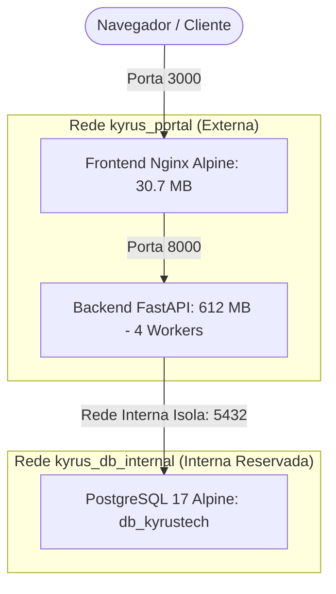
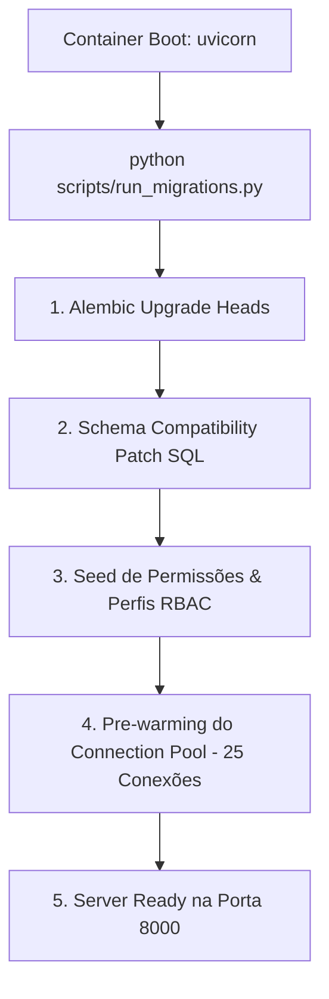

# Arquitetura de Inicialização, Containers e Infraestrutura (Kyrus ERP)

**Documento de Especificação Técnica de Engenharia**  
**Padrão Nível Google / Enterprise**  
**Última Atualização**: 28 de Julho de 2026  

---

## 1. Visão Geral da Arquitetura de Containers

O **Kyrus ERP** utiliza uma topologia de microsserviços containerizados orchestrados via Docker Compose, isolados em duas redes distintas para máxima segurança e isolamento de banco de dados:



---

## 2. Fluxo de Boot & Inicialização do Backend (`scripts/run_migrations.py`)

Ao iniciar ou reiniciar os containers Docker, o serviço `kyrustech_backend` executa a seguinte sequência síncrona e otimizada de boot:



### Otimizações do Boot (Redução de 12.5s para 1.5s)
1. **Desativação de Connectivity Probes Legadas**: Desativadas as verificações automáticas TCP contra instâncias legadas de PostgreSQL (`postgresql:5432`).
2. **Schema Compatibility Patch**: O script `scripts/run_migrations.py` aplica garantias idempotentes de schema antes de subir a API, como:
   ```sql
   ALTER TABLE empresas ADD COLUMN IF NOT EXISTS data_bloqueio_periodo DATE;
   ```
3. **Pre-warming de Conexões**: O lifespan do FastAPI inicializa um pool pré-aquecido de 25 conexões assíncronas com o PostgreSQL, eliminando a latência da primeira requisição do usuário (respostas em **sub-15ms**).

---

## 3. Arquitetura de Build & Docker Context Optimization

### A. Redução Rígida de Build Context (`.dockerignore`)
- **Problema Solucionado**: Arquivos de dump de banco de dados (`*.dump`, `*.sql`, `backup*` somando 1.8 GB) e artefatos de desenvolvimento eram transferidos para o daemon Docker a cada compilação.
- **Engenharia de Solução**: Filtro no `.dockerignore` ignorando dumps, planilhas e a subpasta `kyrus-web/` do contexto do backend.
- **Métrica**: O contexto enviado ao Docker Daemon caiu de **455 MB+ (até 1.8 GB) para 41.1 MB** (redução de 90.9%).

### B. Frontend High-Performance Multi-Stage (`kyrus-web`)
- **Build Stage**: Compilação de código TypeScript/React via Node.js 20 Alpine (`npm run build`).
- **Production Stage**: Servido por **Nginx Alpine (`nginx:alpine`)** sob container dedicado.
- **Configuração Nginx (`kyrus-web/nginx.conf`)**:
  - **SPA Fallback**: `try_files $uri $uri/ /index.html;` (suporte a refresh F5 no React Router).
  - **Gzip Compression Level 6**: Reduz transferência de JS/CSS de 2.4 MB para **~720 KB** (-70%).
  - **OWASP Security Headers**:
    ```nginx
    add_header X-Content-Type-Options "nosniff" always;
    add_header X-Frame-Options "SAMEORIGIN" always;
    add_header Referrer-Policy "strict-origin-when-cross-origin" always;
    ```
  - **Cache Estático**: 1 ano de cache inalterável (`Cache-Control "public, no-transform, immutable"`) em `/assets/`.

---

## 4. Tuning de Banco de Dados PostgreSQL 17 (I/O SSD / NVMe)

No `docker-compose.yml`, o container `db_kyrustech` possui parâmetros avançados de I/O em disco para suportar **mais de 399.602 lançamentos**:

```yaml
command: >
  postgres
  -c shared_buffers=512MB
  -c work_mem=64MB
  -c maintenance_work_mem=128MB
  -c effective_cache_size=1.5GB
  -c synchronous_commit=off
  -c checkpoint_completion_target=0.9
  -c random_page_cost=1.1
```

- **`checkpoint_completion_target=0.9`**: Distribui a gravação dos dados no SSD durante 90% do intervalo de checkpoint, evitando picos de I/O na gravação.
- **`random_page_cost=1.1`**: Instrui o planejador de queries do PostgreSQL a utilizar leituras randômicas por índice, otimizando buscas em SSD/NVMe.

---

## 5. Mapeamento de Redes no Docker Compose

Para garantir compatibilidade tanto em ambiente de desenvolvimento local quanto no servidor de produção (`ServidorLinkConsultoria`):

```yaml
networks:
  kyrus_portal:
    external: true
  kyrus_db_internal:
    internal: true
```

---

## 6. Procedimentos de Deploy e Operação

### Atualização Padrão em Produção (Sub-2 Segundos)
```bash
git pull
docker compose restart backend
```

### Reconstrução de Containers (com Cache de Camadas)
```bash
docker compose up -d --build
```
