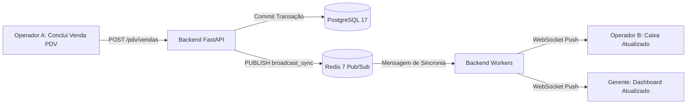

[🗺️ Visão Geral](file:///c:/Users/Ciro/Documents/ERP/KyrusERP/docs/Visao%20Geral.md) / [🚀 Fluxo de Desenvolvimento](file:///c:/Users/Ciro/Documents/ERP/KyrusERP/docs/Loops%20e%20Validacoes.md)
***

# 🔄 Fluxos e Integrações do Kyrus ERP

**Padrão Nível Google / Enterprise**  
**Última Atualização**: 26 de Setembro de 2026  

Este documento detalha os fluxos de automação assíncrona, sincronização em tempo real e integrações do Kyrus ERP.

---

## 📥 1. Fluxo de Importação OFX & Conciliação Bancária
Permite conciliar o extrato bancário com os lançamentos contábeis da empresa.
1.  **Leitura do Arquivo**: O extrato OFX/XML é processado via parser seguro no endpoint de importação bancária.
2.  **Motor Heurístico de Correspondência**:
    *   **Correspondência Exata**: Busca por lançamentos previstos com mesmo valor e data idêntica.
    *   **Correspondência por Janela**: Busca lançamentos atrasados ou antecipados em até ±5 dias com mesmo valor.
    *   **Classificação Inteligente**: Aplica `mapeamentos_categoria` para preencher automaticamente o Plano de Contas com base no histórico de descrições/fornecedores.
3.  **Idempotência**: Cada transação do OFX possui um identificador único (`import_hash` / `fitid`) gravado em `idempotency_logs` para impedir duplicidades se o extrato for reenviado.

---

## 🧾 2. Integração com Gateways Bancários (Asaas & Open Finance)
Gerencia cobranças automáticas, boletos, PIX dinâmico e conciliação de recebimentos.
*   **Background Scheduler (`integracao_scheduler.py`)**: Roda em background no lifespan da aplicação FastAPI a cada 60 segundos, chamando `run_due_integracoes_sync` para sincronizar status de cobranças pendentes e atualizar saldos.
*   **Webhooks**: O gateway notifica eventos (`PAYMENT_RECEIVED`, `PAYMENT_OVERDUE`). O endpoint de webhook valida a assinatura do payload e executa a baixa automática do título no banco de dados.

---

## ⚡ 3. Sincronização em Tempo Real (Redis Pub/Sub & WebSockets)
Permite que alterações financeiras ou de PDV feitas por um usuário sejam refletidas instantaneamente nas telas de outros operadores da mesma empresa, sem recarregar a página.

*   **Canal por Tenant**: Os eventos de broadcast são roteados por `empresa_id` (`channel:empresa_{id}`), garantindo isolamento estrito entre clientes.
*   **Zustand Sync**: No frontend, o WebSocket listener dispara invalidação seletiva de cache (`useTransactionStore`, `useDashboardStore`), mantendo a UI em sincronia sub-segundo.

---

## 💳 4. Módulo de Cartões & Conciliação em Lote
1.  **Upload de Faturas Excel / CSV (`upload_xlsx`)**:
    *   O processamento de planilhas pesadas (`openpyxl`) é executado em rotas sem bloqueio do event loop (`def upload_xlsx` com pool `anyio`), permitindo o upload de faturas com mais de 5.000 linhas sem travar a API.
2.  **Lotes de Cartão (`LoteCartao`)**: As transações são agrupadas em lotes para permitir conciliação prévia antes da efetivação no financeiro.
3.  **Regras de Cartão (`RegraCartao`)**: Regras baseadas em expressões regulares (regex) e palavras-chave classificam automaticamente o portador, centro de custo e plano de contas das despesas.

---

## 🏪 5. Frente de Caixa (PDV), Estoque & Delivery
1.  **Venda Rápida com Idempotência**: A criação de vendas utiliza a chave `X-Idempotency-Key` enviada pelo cliente. Transmissões repetidas por oscilação de rede retornam o resultado da venda já gravada, sem duplicar baixa contábil.
2.  **Baixa Automática de Estoque**: A cada item vendido (`PdvVendaItem`), uma `MovimentacaoEstoque` do tipo `SAIDA_VENDA` é gerada na mesma transação atômica do banco.
3.  **Observações em JSON Estruturado**: O campo `observacao` armazena metadados dinâmicos como dados de delivery iFood, autorização de TEF, número de série de equipamentos e justificativas de cancelamento.
4.  **Controle de Acesso Blindado**: Cancelamento de vendas, sangrias de caixa e alterações de vendedor exigem permissões específicas validadas no backend (`PDV_CANCELAR_VENDA`, `PDV_REALIZAR_SANGRIA`, `PDV_VER_TODAS_VENDAS`).

---

## 🚨 6. Motor de Auditoria & Detecção de Anomalias
1.  **Trilha Imutável (`audit_logs`)**: Todas as mutações críticas (alteração de valor de título, exclusão de lançamento, cancelamento de venda) registram um snapshot com o estado anterior e o novo estado em JSON, IP do cliente e `user_id`.
2.  **Detecção Automática de Anomalias (`AlertaAnomalia`)**: O motor de auditoria analisa desvios em tempo real:
    *   Lançamentos com valor acima de 3x o desvio padrão da categoria.
    *   Sangrias fora do horário comercial ou acima do teto estipulado.
    *   Duplicidade de pagamentos ao mesmo fornecedor em curto intervalo.
3.  **Silenciamento Controlado (`RegraSilenciamentoAuditor`)**: Permite que administradores definam tolerâncias para desconsiderar regras em operações sazonais legítimas, evitando fadiga de alertas.

---

## 🧹 7. Limpeza Automática de Ambientes de Demonstração
*   **Serviço de Purga (`demo_cleanup_service.py`)**: Roda periodicamente para purgar dados efêmeros de empresas criadas para testes ou demonstrações públicas que atingiram a data limite de retenção, garantindo higiene e otimização contínua do banco de dados.

