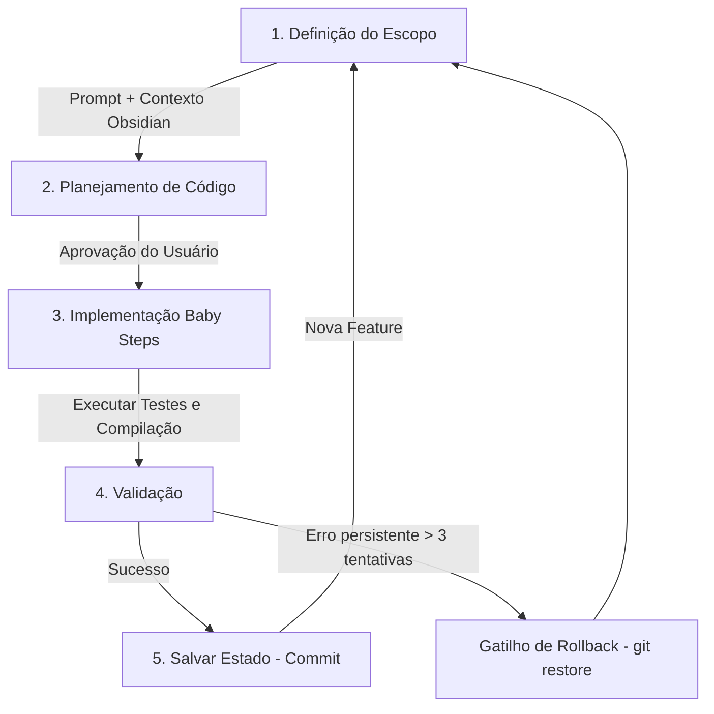

[🗺️ Visão Geral]([[Visao Geral]]) / [🚀 Fluxo de Desenvolvimento]([[Loops e Validacoes]])
***

# 🔄 Loops de Desenvolvimento e Validações

Como "Vibe Coder", o maior risco é delegar tarefas e perder a visibilidade se o sistema continua íntegro ou não. Para resolver isso, estruturamos um **Loop de Desenvolvimento em 5 Etapas** auxiliado por **Validações Automáticas e de Segurança**.

---

## 1. O Loop de Desenvolvimento do Agente

Toda nova funcionalidade ou correção deve passar por este loop rígido e fechado. Nunca quebre a ordem:



### 1️⃣ Definição do Escopo
Você inicia o prompt definindo o objetivo e fornecendo o contexto com as notas do Obsidian:
*   *Prompt Exemplo:* `"Preciso que você crie o endpoint de relatórios. Use o contexto de @Modelos de Dados.md para entender as tabelas e respeite as regras de multitenancy de @Regras de Seguranca.md."*

### 2️⃣ Planejamento de Código (Planning)
O agente deve listar todos os arquivos que serão alterados ou criados, a lógica que será aplicada e o plano de testes. **Nenhuma linha de código deve ser editada nesta etapa.**
*   Você revisa o plano. Se notar que a IA planejou algo que pode quebrar outra parte do ERP, você corrige o plano no chat.

### 3️⃣ Implementação em Baby Steps (Passos Curtos)
Após aprovado, o agente executa a implementação. Se o plano tiver 3 etapas (ex: Banco -> Endpoint -> Frontend), o agente faz **um arquivo de cada vez**, parando para validar após cada passo.

### 4️⃣ Validação (Onde rodam as checagens)
O agente ou você executa os comandos de validação (detalhados abaixo) para garantir que a alteração não quebrou nada.

### 5️⃣ Salvar Estado (Git Save Point)
Se as validações passarem, faça o commit imediato:
```bash
git add .
git commit -m "feat: endpoint de relatorios adicionado com sucesso"
```

### 6️⃣ Autodocumentação de Bugs (Post-Execution)
Se a alteração envolveu a correção ou identificação de um bug crítico de banco de dados, concorrência, vazamento de memória ou cibersegurança, o agente **deve** atualizar a documentação em [[Bugs e Performance de Banco]] relatando a causa raiz e a solução. Adicionalmente, o agente deve atualizar as respectivas diretrizes e boas práticas nos documentos principais do projeto (como [[Regras de Seguranca]], [[Modelos de Dados]] ou [[Fluxos e Integracoes]]) para evitar reincidências.

### 🚨 O Gatilho de Rollback (Se tudo der errado)
Se o agente introduzir um bug, tentar consertar mais de 3 vezes e continuar dando erro: **pare**.
Rode no terminal:
```bash
git restore .
git clean -df
```
Isso apaga todas as tentativas frustradas e volta para o último commit seguro. Você muda o prompt e recomeça o loop do zero com a mente limpa.

---

## 2. As Validações: O que checar?

Para garantir que o código escrito pela IA é robusto, executamos três tipos de validações:

### 🅰️ Validação Estática (Código e Tipagem)
Impede que bugs de sintaxe ou variáveis inexistentes entrem no projeto.
1.  **Frontend (TypeScript):**
    Rode o comando de compilação para verificar se há erros de tipo ou variáveis quebradas:
    ```bash
    cd kyrus-web
    npx tsc --noEmit
    ```
2.  **Backend (Linter/FastAPI):**
    Rode o pytest no backend para verificar se os imports e as rotas estão corretos:
    ```bash
    pytest
    ```

### 🅱️ Validação de Segurança (Multitenancy & IDOR)
Toda vez que a IA criar uma rota de banco de dados, você deve forçar uma pergunta de auditoria no chat:
*   *"O código que você escreveu garante que o `empresa_id` de todos os registros seja verificado contra o `empresa_id` do token do usuário? Me mostre a linha onde essa validação ocorre."*

Isso força o agente a reler o próprio código e validar se cometeu algum erro de IDOR (Insecure Direct Object Reference) ao expor um ID sequencial.

### 🅲️ Validação de Idempotência (Financeiro)
No financeiro, lançamentos não podem ser duplicados por cliques duplos do usuário ou falhas de rede.
*   **A IA deve usar tokens de transação:** Ao cadastrar vendas, faturas ou importações, certifique-se de que a tabela correspondente tem um campo `import_hash` ou `idempotency_key` único.
*   **Como testar:** Peça para a IA: *"Escreva um teste que simule o envio de duas requisições idênticas seguidas com o mesmo cabeçalho X-Idempotency-Key. A segunda requisição deve retornar erro ou retornar o mesmo objeto sem duplicar a linha no banco de dados."*
