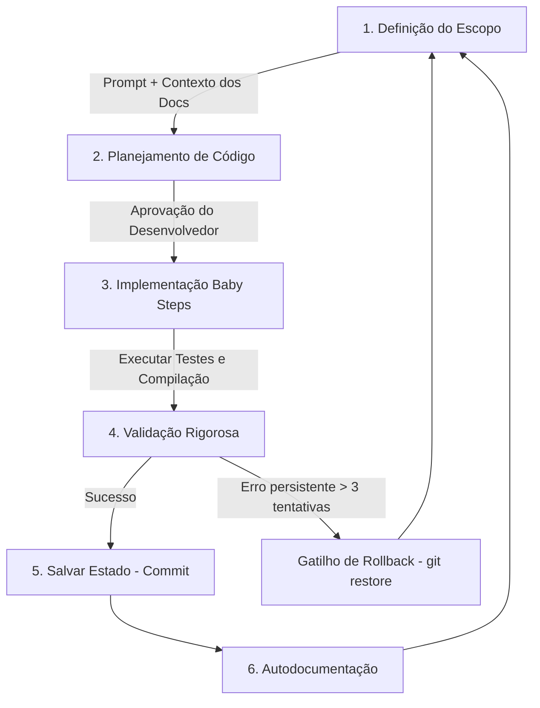

[🗺️ Visão Geral](file:///c:/Users/Ciro/Documents/ERP/KyrusERP/docs/Visao%20Geral.md) / [🚀 Fluxo de Desenvolvimento](file:///c:/Users/Ciro/Documents/ERP/KyrusERP/docs/Loops%20e%20Validacoes.md)
***

# 🔄 Loops de Desenvolvimento e Validações

**Padrão Nível Google / Enterprise**  
**Última Atualização**: 26 de Setembro de 2026  

Como "Vibe Coder" e Engenheiro de Software Corporativo, o maior risco é delegar tarefas e perder a visibilidade se o sistema continua íntegro ou não. Para resolver isso, estruturamos um **Loop de Desenvolvimento em 6 Etapas** auxiliado por **Validações Automáticas e de Segurança**.

---

## 1. O Loop de Desenvolvimento do Agente

Toda nova funcionalidade ou correção deve passar por este loop rígido e fechado. Nunca quebre a ordem:



### 1️⃣ Definição do Escopo
Você inicia o prompt definindo o objetivo e fornecendo o contexto com as notas da documentação:
*   *Prompt Exemplo:* `"Preciso que você crie o endpoint de relatórios. Use o contexto de @Modelos de Dados.md para entender as tabelas e respeite as regras de multitenancy de @Regras de Seguranca.md."*

### 2️⃣ Planejamento de Código (Planning)
O agente deve listar todos os arquivos que serão alterados ou criados, a lógica que será aplicada e o plano de testes. **Nenhuma linha de código deve ser editada nesta etapa.**

### 3️⃣ Implementação em Baby Steps (Passos Curtos)
Após aprovado, o agente executa a implementação. Se o plano tiver 3 etapas (ex: Banco -> Endpoint -> Frontend), o agente faz **um arquivo de cada vez**, parando para validar após cada passo.

### 4️⃣ Validação (Onde rodam as checagens)
O agente ou você executa os comandos de validação automatizada (TypeScript, Vitest, Pytest) para garantir que a alteração não quebrou nada.

### 5️⃣ Salvar Estado (Git Save Point)
Se as validações passarem, faça o commit imediato:
```bash
git add .
git commit -m "feat: endpoint de relatorios adicionado com sucesso"
```

### 6️⃣ Autodocumentação de Bugs & Arquitetura (Post-Execution)
Se a alteração envolveu a correção ou identificação de um bug crítico de banco de dados, concorrência, vazamento de memória ou cibersegurança, o agente **deve** atualizar a documentação em [Bugs e Performance de Banco](file:///c:/Users/Ciro/Documents/ERP/KyrusERP/docs/Bugs%20e%20Performance%20de%20Banco.md) relatando a causa raiz e a solução. Adicionalmente, o agente deve atualizar as respectivas diretrizes nos documentos principais do projeto ([Regras de Segurança](file:///c:/Users/Ciro/Documents/ERP/KyrusERP/docs/Regras%20de%20Seguranca.md), [Modelos de Dados](file:///c:/Users/Ciro/Documents/ERP/KyrusERP/docs/Modelos%20de%20Dados.md) ou [Fluxos e Integrações](file:///c:/Users/Ciro/Documents/ERP/KyrusERP/docs/Fluxos%20e%20Integracoes.md)) para evitar reincidências.

### 🚨 O Gatilho de Rollback (Se tudo der errado)
Se o agente introduzir um bug, tentar consertar mais de 3 vezes e continuar dando erro: **pare**.
Rode no terminal:
```bash
git restore .
git clean -df
```
Isso apaga todas as tentativas frustradas e volta para o último commit seguro. Você muda o prompt e recomeça o loop do zero com a mente limpa.

---

## 2. As Validações: O que checar?

Para garantir que o código escrito pela IA é robusto, executamos três tipos de validações:

### 🅰️ Validação Estática e Testes Automatizados
Impede que bugs de sintaxe, variáveis inexistentes ou regressões entrem no projeto.
1.  **Frontend (TypeScript & Vitest):**
    Rode o comando de compilação e a suíte de testes unitários:
    ```bash
    cd kyrus-web
    npm run build
    npm test
    ```
2.  **Backend (Pytest & Alembic):**
    Rode a suíte de testes do backend para verificar se os models e as rotas estão corretos:
    ```bash
    pytest -q
    ```

### 🅱️ Validação de Segurança (Multitenancy Canônico & Anti-IDOR)
Toda vez que a IA criar uma rota de banco de dados, verifique a seguinte regra de ouro:
*   *O endpoint injeta `empresa_id: int = Depends(get_empresa_id_from_user)` e filtra todas as consultas e mutações por `empresa_id`?*
*   **NUNCA utilize** `current_user.empresa_id`, pois isso ignora a troca de empresas por consultores via header `X-Company-ID`.
*   Todas as atualizações ou deleções por ID devem combinar `Model.id == id` e `Model.empresa_id == empresa_id`.

### 🅲️ Validação de Idempotência (Financeiro e PDV)
No financeiro, lançamentos e vendas não podem ser duplicados por cliques duplos do usuário ou oscilações de rede.
*   **Tokens de transação:** Ao cadastrar vendas, faturas ou importações, certifique-se de que a tabela correspondente tem um campo `import_hash` ou suporte a `X-Idempotency-Key` gravado em `idempotency_logs`.

