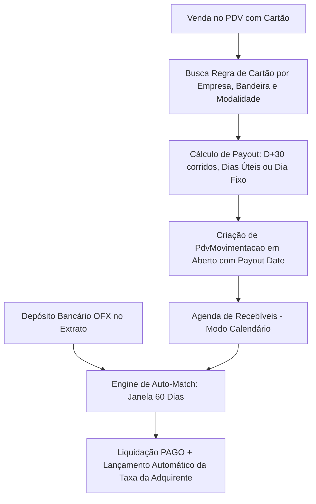

# Manual da Conciliadora de Cartões (Kyrus ERP)

**Documento Funcional e de Arquitetura de Negócio**  
**Padrão Nível Google / Enterprise**  
**Última Atualização**: 26 de Setembro de 2026  

---

## 1. Visão Geral da Arquitetura do Módulo

A **Conciliadora de Cartões** do Kyrus ERP gerencia a agenda de recebíveis de adquirentes (Cielo, Rede, Stone, PagSeguro, etc.), calculando automaticamente o vencimento líquido, as taxas de administração/antecipação e conciliando os depósitos bancários contra as vendas do PDV.

---

## 2. Payout Engine & Regras de Vencimento

### A. Tipos de Prazo de Repasse
1. **Dias Corridos (D+X)**: Soma $X$ dias corridos à data da venda.
2. **Dias Úteis (D+X úteis)**: Soma apenas dias de semana (segunda a sexta-feira).
3. **Dia Fixo do Mês**: Repasse agendado para um dia fixo (ex: todo dia 5 do mês seguinte).

### B. Rollover de Final de Semana (`fds_proximo_dia_util`)
Se o vencimento calculado cair em um sábado ou domingo e a flag `fds_proximo_dia_util` estiver ativa, o vencimento é transferido automaticamente para a próxima segunda-feira útil.

### C. Normalização Transparente de Modalidades (`obter_regra_cartao`)
O motor aceita e normaliza automaticamente variações de nomenclatura de adquirentes:
- `"cartao_credito_vista"`, `"credito_vista"` $\rightarrow$ `CREDITO_AVISTA`
- `"cartao_credito_parcelado"`, `"credito_parcelado"` $\rightarrow$ `CREDITO_PARCELADO`
- `"cartao_debito"`, `"debito"` $\rightarrow$ `DEBITO`

---

## 3. Motor de Auto-Match (Conciliação Assistida)

O endpoint `/api/v1/pdv/conciliacao/auto-match` executa um algoritmo de correspondência estatística:

1. **Seleção de Alvo**: O usuário seleciona um lançamento de crédito vindo do extrato bancário.
2. **Janela de Busca Expandida (60 dias)**: O sistema busca todas as `PdvMovimentacao` em aberto com datas de transação de até **60 dias antes da data do depósito** (cobrindo vendas parceladas ou com repasse D+30).
3. **Agrupamento por Vencimento Líquido e Bandeira**: Os recebíveis são somados pelo valor líquido previsto (valor bruto descontado da taxa da adquirente).
4. **Scoring de Assertividade**:
   - Vencimento líquido exato no dia do depósito + valor idêntico: **Score 100**.
   - Variação de até 7 dias na data do depósito: Desconto proporcional de pontuação.
5. **Liquidação em Lote**: Ao aprovar a sugestão:
   - Marca o recebível como `PAGO` (`conciliado = True`).
   - Registra o lançamento da taxa de administração no exato dia do recebimento real na conta da empresa.

---

## 4. Otimização de Performance no Carregamento & Upload Seguro

1. **Eliminação de Consultas N+1 (`selectinload`)**: O endpoint `GET /api/v1/pdv/recebiveis` carrega os produtos vinculados utilizando `selectinload(PdvVendaItem.produto)`, reduzindo centenas de queries individuais a apenas **1 consulta SQL otimizada**.
2. **Processamento sem Bloqueio de Thread (`upload_xlsx`)**: O endpoint de upload em massa de planilhas de fatura foi desenhado como rota síncrona com pool de workers dedicado, impedindo que o parsing de arquivos `.xlsx` com milhares de linhas trave o event loop do FastAPI.

---

## 5. Trava de Integridade Financeira & Blindagem Anti-IDOR

- **Multi-Tenant Canônico**: Todas as rotas de faturas, cartões e recebíveis injetam `empresa_id: int = Depends(get_empresa_id_from_user)`, garantindo que faturas de clientes distintos nunca se cruzem no sistema.
- **Proteção Anti-IDOR**: Operações de mutação (`PUT /pdv/recebiveis/{id}`, `PUT /cartoes/{id}`) filtram rigorosamente por `id` e `empresa_id`.
- **Bloqueio Contábil**: Títulos com status `PAGO` ou já conciliados com extrato bancário possuem **bloqueio de alteração**, impedindo discrepâncias no DRE e nos saldos de caixa das empresas.

