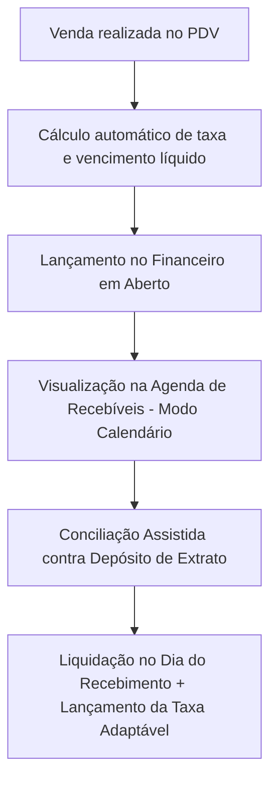

[🗺️ Visão Geral]([[Visao Geral]]) / [🚀 Fluxo de Desenvolvimento]([[Loops e Validacoes]])
***

# Manual da Conciliadora de Cartões (Kyrus ERP)

Este documento explica em detalhes o funcionamento da **Conciliadora de Cartões**, módulo responsável por prever vencimentos líquidos, controlar taxas de administração/antecipação, gerenciar a agenda no modo calendário e conciliar depósitos bancários de adquirentes contra vendas do PDV.

---

## 1. Visão Geral do Fluxo

A Conciliadora de Cartões funciona de forma integrada entre o **PDV (Frente de Caixa)** e o **Financeiro**. O fluxo é dividido em 4 etapas:

1. **A Venda**: Ao realizar uma venda por cartão (crédito/débito) no PDV, o sistema consulta a regra cadastrada para aquela bandeira e tipo de pagamento.
2. **Cálculo da Provisão**: O sistema calcula a data exata do repasse, desconta a taxa da adquirente (e de antecipação, se houver) e gera os lançamentos financeiros em aberto com o valor líquido previsto.
3. **Agenda de Recebíveis (Calendário)**: As parcelas e previsões de repasse ficam listadas em uma interface dinâmica em modo calendário por padrão, agrupadas por data de vencimento líquido.
4. **Conciliação e Baixa**: Quando a adquirente deposita o dinheiro na conta bancária (verificado via extrato de importação OFX), o usuário utiliza o painel de **Conciliação Assistida** para cruzar o depósito com o lote de recebíveis correspondentes. O sistema baixa o recebível como pago e lança o valor das taxas automaticamente no exato dia do recebimento.

---

## 2. Usabilidade e Modo Calendário Padrão

### A. Inicialização e Fluidez
- Por padrão, a Conciliadora de Cartões abre diretamente na visualização em **Modo Calendário** (`viewMode = 'calendar'`).
- A navegação entre os dias do calendário e os detalhes do lote é otimizada para evitar re-renderizações ou piscadas (*flickering*): ao clicar em um dia, a seleção é local e não re-engatilha chamadas redundantes de rede.

### B. Edição Dinâmica de Bandeira e Valores (`PUT /pdv/recebiveis/{id}`)
- Caso o usuário precise alterar a bandeira ou o valor bruto de uma venda/recebível direto na conciliadora:
  - O sistema faz o **recálculo automático das taxas** e ajusta o valor líquido previsto e a conta de despesa associada.
  - **Trava de Segurança**: Se o título já estiver com status **PAGO** ou vinculado a uma conta bancária com extrato conciliado, a alteração é bloqueada para manter a integridade dos saldos financeiros.

---

## 3. Regras de Lançamento de Taxas Adquirentes

### A. Momento do Lançamento (Sem Retroativos / Sem Futuros)
- O lançamento das taxas de administração de cartão em **Lançamentos (`/lancamentos`)** é registrado **exclusivamente no dia do recebimento real** (`data_pagamento`).
- Não são gerados lançamentos de despesa futuros ou retroativos de taxa durante a venda em aberto; a despesa financeira é contabilizada dinamicamente no momento da baixa/conciliação do lote.

### B. Discriminação por Modalidade e Bandeira
- Cada lançamento de taxa gerado discrimina a modalidade de pagamento e a bandeira do cartão no histórico:
  - Exemplo Débito: `Taxa de Adm. Cartão Débito (VISA) Lote #12`
  - Exemplo Crédito: `Taxa de Adm. Cartão Crédito (MASTERCARD) Lote #13`
  - Exemplo Crédito Parcelado: `Taxa de Adm. Cartão Crédito Parcelado (ELO) Lote #14`
- A categoria financeira (`plano_contas_taxa_id`) adapta-se dinamicamente conforme cadastrado na regra específica daquela adquirente/bandeira.

---

## 4. Regras de Payout (Prazos de Recebimento)

Cada adquirente possui regras específicas de repasse. O sistema permite configurar três tipos principais de prazos:

### A. Dias Corridos (D+X)
* **Como funciona**: Soma-se o número de dias corridos à data da venda.
* **Exemplo**: Venda em 13/06/2026 com D+30 corridos vencerá em 13/07/2026.

### B. Dias Úteis (D+X úteis)
* **Como funciona**: Soma-se apenas os dias de semana (segunda a sexta), pulando feriados nacionais e finais de semana.

### C. Dia Fixo do Mês
* **Como funciona**: O repasse é agendado sempre para um dia específico (ex: todo dia 5).

### Rollover de Fim de Semana (fds_proximo_dia_util)
Se a data de vencimento calculada cair em um sábado ou domingo, e esta opção estiver ativa, o sistema empurra o vencimento automaticamente para a segunda-feira seguinte.

---

## 5. O Motor de Auto-Match (Conciliação Assistida)

Quando o extrato bancário (OFX) é importado, o **Motor de Auto-Match** executa o seguinte algoritmo:

1. **Seleção do Alvo**: O usuário clica em um depósito do extrato bancário.
2. **Busca e Filtragem**: O sistema busca todos os recebíveis de cartão da empresa que estão com status `EM ABERTO` em uma janela de até 7 dias.
3. **Cálculo de Combinações**: Agrupa recebíveis da mesma data de vencimento e bandeira ou realiza combinações combinatórias para encontrar uma soma perfeita.
4. **Liquidação e Baixa**:
   - Altera o status do recebível da venda de `EM ABERTO` para `PAGO`.
   - Cria o lançamento de despesa do tipo **DESPESA** no valor exato da taxa no dia do pagamento.
