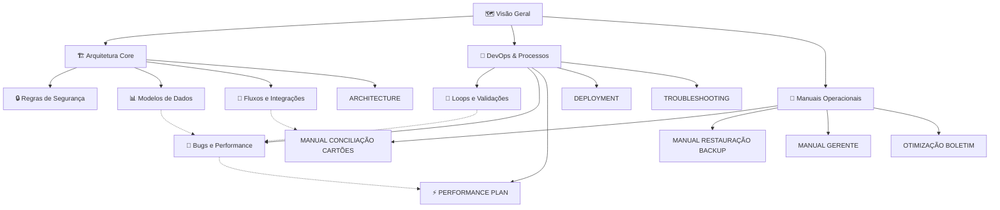

# 🗺️ Visão Geral do Kyrus ERP

Bem-vindo ao cofre do Kyrus ERP. Este documento serve como ponto de partida para entender o funcionamento e a organização do sistema.

## 🏗️ Arquitetura do Sistema
O Kyrus ERP é construído sob uma arquitetura de duas camadas principais (Frontend SPA e Backend REST API) totalmente conteinerizadas em Docker.

- **Backend**: FastAPI (Python), SQLModel (ORM), PostgreSQL.
- **Frontend**: React (TypeScript) + Vite + Tailwind CSS v4.
- **Auditoria**: Mixins de banco que registram todas as criações, edições e exclusões no banco de dados (`is_deleted` para soft-deletes).

---

## 🗂️ Links Rápidos de Navegação (Obsidian Wiki)

### 🏗️ Arquitetura e Modelagem Core
*   [[Visao Geral]] - Visão geral da arquitetura de duas camadas.
*   [[Regras de Seguranca]] - Normas críticas contra vazamento de dados de empresas.
*   [[Modelos de Dados]] - Estrutura e relacionamentos das tabelas do banco.
*   [[Fluxos e Integracoes]] - Como funciona o fluxo financeiro e conexões como Asaas.
*   [[ARCHITECTURE]] - Detalhamento arquitetural legado e histórico técnico.

### 🚀 Fluxo de Desenvolvimento e DevOps
*   [[Loops e Validacoes]] - Loop de desenvolvimento de 6 passos e validações recomendadas.
*   [[Bugs e Performance de Banco]] - Guia de bugs históricos de concorrência e boas práticas de banco de dados.
*   [[PERFORMANCE_PLAN]] - Plano detalhado de otimização de infraestrutura e performance.
*   [[DEPLOYMENT]] - Manual detalhado de deploy e empacotamento em produção.
*   [[TROUBLESHOOTING]] - Guia de diagnóstico e resolução de problemas comuns de ambiente.

### 📖 Manuais Operacionais e de Negócio
*   [[MANUAL_CONCILIACAO_CARTOES]] - Manual de conciliação de cartões de crédito e adquirentes.
*   [[MANUAL_RESTAURACAO_BACKUP]] - Procedimento passo a passo para restauração de backups em containers.
*   [[MANUAL_MIGRACAO_DADOS]] - Guia e manual completo para migração e importação de dados de empresas.
*   [[MANUAL_GERENTE]] - Guia de uso e relatórios para administradores e gerentes.
*   [[OTIMIZACAO_BOLETIM]] - Checklist técnico de otimização de boletim e fechamentos contábeis.

---

## 💻 Stack Tecnológico
*   **Gerenciador de Estado**: Zustand.
*   **Ícones**: Lucide React.
*   **Banco de Dados**: PostgreSQL com migrations via Alembic.

---

## 🗺️ Mapa Relacional da Documentação (Obsidian Graph)

