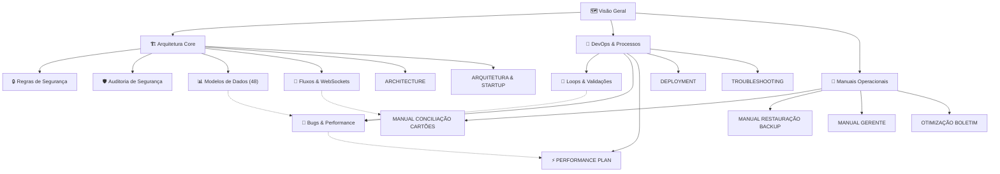

# 🗺️ Visão Geral do Kyrus ERP

**Padrão Nível Google / Enterprise**  
**Última Atualização**: 26 de Setembro de 2026  

Bem-vindo ao centro de documentação técnica do **Kyrus ERP**. Este documento serve como ponto de partida para entender a topologia, modelos, segurança e diretrizes operacionais do sistema.

## 🏗️ Arquitetura do Sistema
O Kyrus ERP é construído sob uma arquitetura de microsserviços containerizados com separação estrita de redes:

- **Backend**: FastAPI (Python 3.11), SQLModel / SQLAlchemy 2.0 (assíncrono), Uvicorn (4 workers).
- **Banco de Dados**: PostgreSQL 17 Alpine com durabilidade estrita ACID (`synchronous_commit=on`), connection pooling assíncrono pré-aquecido e 48 modelos mapeados no Alembic.
- **Cache & Tempo Real**: Redis 7 Alpine com Pub/Sub para WebSockets e invalidação de cache.
- **Frontend**: React 18 SPA, TypeScript estrito, Vite, Tailwind CSS, Zustand para estado reativo.
- **Auditoria & Governança**: Trilha imutável em `audit_logs` registrando snapshots diff antes/depois, mixin de auditoria corporativo e soft-delete seguro.

---

## 🗂️ Links Rápidos de Navegação

### 🏗️ Arquitetura e Modelagem Core
*   [Visão Geral](file:///c:/Users/Ciro/Documents/ERP/KyrusERP/docs/Visao%20Geral.md) - Visão sistêmica da arquitetura.
*   [Arquitetura e Startup](file:///c:/Users/Ciro/Documents/ERP/KyrusERP/docs/ARQUITETURA_E_STARTUP.md) - Containers, sequência de boot, redes Docker e tuning do PostgreSQL.
*   [Manual de Arquitetura e Engenharia](file:///c:/Users/Ciro/Documents/ERP/KyrusERP/docs/ARCHITECTURE.md) - Princípios, divisão de domínios PDV e topologia do servidor.
*   [Regras de Segurança](file:///c:/Users/Ciro/Documents/ERP/KyrusERP/docs/Regras%20de%20Seguranca.md) - Normas canônicas de multitenancy, proteção anti-IDOR e RBAC.
*   [Auditoria de Segurança](file:///c:/Users/Ciro/Documents/ERP/KyrusERP/docs/security_audit.md) - Relatório de mitigações de vulnerabilidades críticas.
*   [Modelos de Dados](file:///c:/Users/Ciro/Documents/ERP/KyrusERP/docs/Modelos%20de%20Dados.md) - Catálogo completo das 48 tabelas SQLModel por domínio.
*   [Fluxos e Integrações](file:///c:/Users/Ciro/Documents/ERP/KyrusERP/docs/Fluxos%20e%20Integracoes.md) - Schedulers assíncronos, WebSockets, OFX e cartões.

### 🚀 Fluxo de Desenvolvimento e DevOps
*   [Loops e Validações](file:///c:/Users/Ciro/Documents/ERP/KyrusERP/docs/Loops%20e%20Validacoes.md) - Loop de engenharia em 6 passos e comandos de teste.
*   [Bugs e Performance de Banco](file:///c:/Users/Ciro/Documents/ERP/KyrusERP/docs/Bugs%20e%20Performance%20de%20Banco.md) - Guia mestre de concorrência, locks, índices e auditoria.
*   [Plano de Performance](file:///c:/Users/Ciro/Documents/ERP/KyrusERP/docs/PERFORMANCE_PLAN.md) - Otimizações de latência e tuning de queries.
*   [Guia de Deploy](file:///c:/Users/Ciro/Documents/ERP/KyrusERP/docs/DEPLOYMENT.md) - Manual de deploy, ambientes e variáveis de produção.
*   [Troubleshooting](file:///c:/Users/Ciro/Documents/ERP/KyrusERP/docs/TROUBLESHOOTING.md) - Guia de diagnóstico e resolução de problemas comuns.

### 📖 Manuais Operacionais e de Negócio
*   [Manual de Conciliação de Cartões](file:///c:/Users/Ciro/Documents/ERP/KyrusERP/docs/MANUAL_CONCILIACAO_CARTOES.md) - Conciliação de faturas e operadoras.
*   [Manual de Restauração de Backups](file:///c:/Users/Ciro/Documents/ERP/KyrusERP/docs/MANUAL_RESTAURACAO_BACKUP.md) - Procedimento passo a passo para restauração de dumps.
*   [Manual do Gerente](file:///c:/Users/Ciro/Documents/ERP/KyrusERP/docs/MANUAL_GERENTE.md) - Painéis gerenciais, metas e permissões de caixa.
*   [Otimização de Boletim](file:///c:/Users/Ciro/Documents/ERP/KyrusERP/docs/OTIMIZACAO_BOLETIM.md) - Checklist de fechamento e cálculos de DRE.

---

## 🗺️ Mapa Relacional da Documentação

